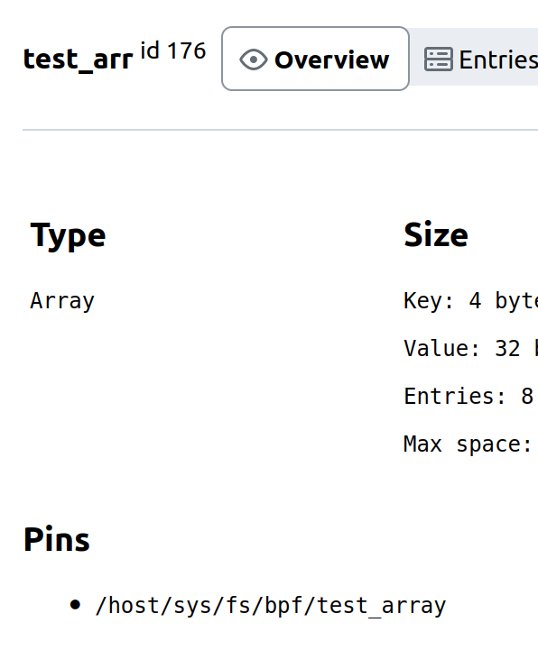
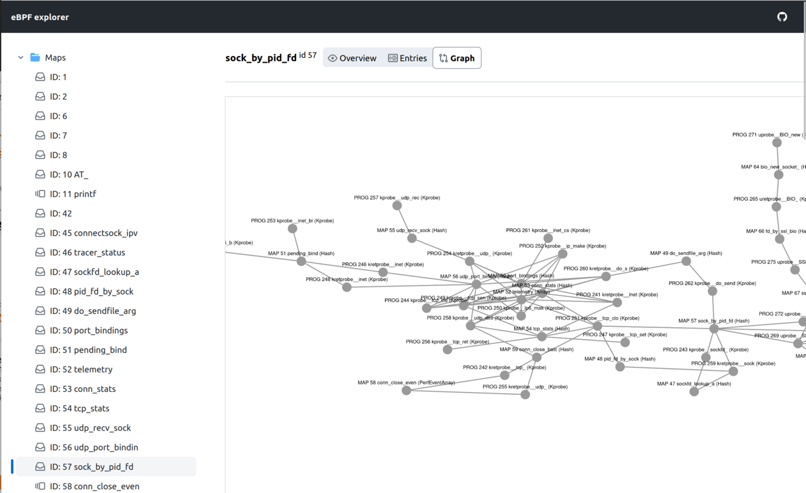
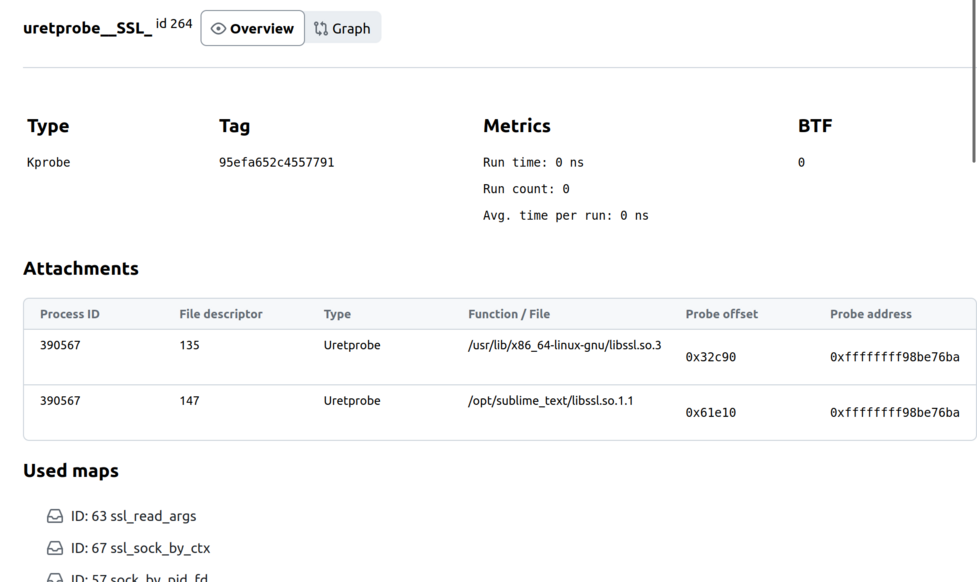
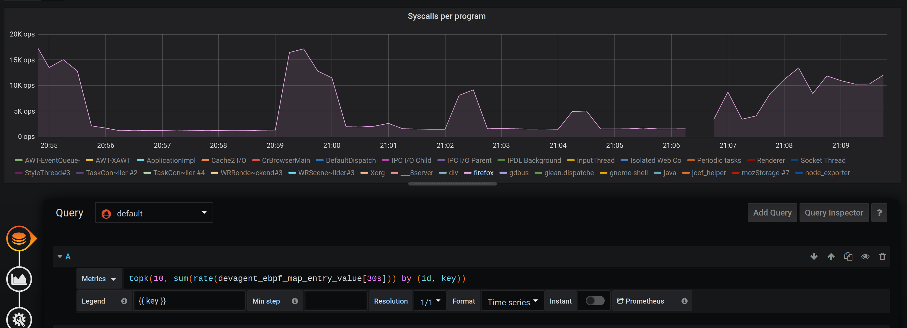

18 june, add and delete map entries
---

Explorer v0.0.7

* add and delete map entries
* number length validation on entry submit

Sub-releases:
* **dev-agent** [v0.0.5](https://github.com/ebpfdev/dev-agent/blob/main/CHANGELOG.md#v005--18-june-2023--add-and-delete-map-entries)
* **explorer-ui** [v0.0.6](https://github.com/ebpfdev/explorer-ui/blob/main/CHANGELOG.md#v006--18-june-2023--add-and-delete-map-entries)

13 june 2023, map editing and pinning
---

Explorer v0.0.6

* map entries table is now editable (experimental, only editing existing values in any available representation)
* displaying paths of pinned maps (if bpffs is available):
  
* map pinning is available via GraphQL query

Sub-releases:
* **dev-agent** [v0.0.4](https://github.com/ebpfdev/dev-agent/blob/main/CHANGELOG.md#v004--13-june-2023--map-editing-and-pinning)
* **explorer-ui** [v0.0.4](https://github.com/ebpfdev/explorer-ui/blob/main/CHANGELOG.md#v004--13-june-2023--map-editor-and-map-pins)

11 june 2023, more connections
---

Explorer v0.0.5

* **dev-agent** [v0.0.3](https://github.com/ebpfdev/dev-agent/blob/main/CHANGELOG.md#v003--11-june-2023--more-connections)
  * (feature) exposed tracepoints that programs are attached to
  * (feature) a new method in GraphQL to get a connected graph starting from a specific program or map
* **explorer-ui** [v0.0.3](https://github.com/ebpfdev/explorer-ui/blob/main/CHANGELOG.md#v003--11-june-2023--more-connections)
  * (feature) new Graph View for exploring connected programs and maps (available from details page of both):
    
  * (feature) showing list of tracepoints that program is attached to on program's details page:
    

4 june 2023, Prometheus exporter
---

Explorer v0.0.4

* **dev-agent** [v0.0.2](https://github.com/ebpfdev/dev-agent/blob/main/CHANGELOG.md#v002--3-june-2023--export-to-prometheus-metrics)
  * (feature) eBPF metrics prometheus exporter:
    * progs statistics (run_time, run_count)
    * maps statistics
      * number of entries (if configured, see [README](./README.md))
      * value of entries (if configured):
        
* **explorer-ui** [v0.0.2](https://github.com/ebpfdev/explorer-ui/blob/main/CHANGELOG.md#v002--4-june-2023--neat-fixes)
  * various layout fixes (see the changelog for details), e.g.:
    * better table for map entries

28 may 2023, kickstarted
---

Explorer v0.0.2

* **dev-agent** [v0.0.1](https://github.com/ebpfdev/dev-agent/blob/main/CHANGELOG.md#v001--28-may-2023--graphql-kickstarted)
  * GraphQL API, which exposes:
    * programs and maps metadata
    * traversing between programs and maps
      
      relation is defined by `bpf_prog_aux->used_maps` ([see in Linux](https://github.com/torvalds/linux/blob/4ecd704a4c51fd95973fcc3a60444e0e24eb9439/include/linux/bpf.h#L1400))
    * map entries including various representation (hex, number, string)
* **explorer-ui** [v0.0.1](https://github.com/ebpfdev/explorer-ui/blob/main/CHANGELOG.md#v001--28-may-2023--graphql-kickstarted)
  * react web app, which consumes GraphQL API
    * displays all programs and maps in a file tree on a sidebar
    * pages for viewing program and map details
      * on a map page, displays entries in a table with pagination