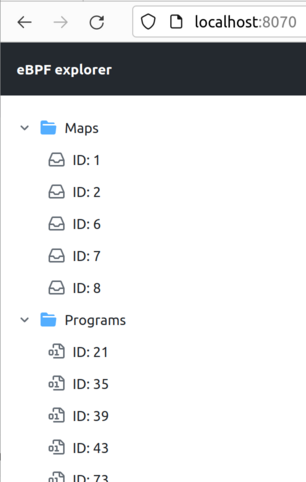
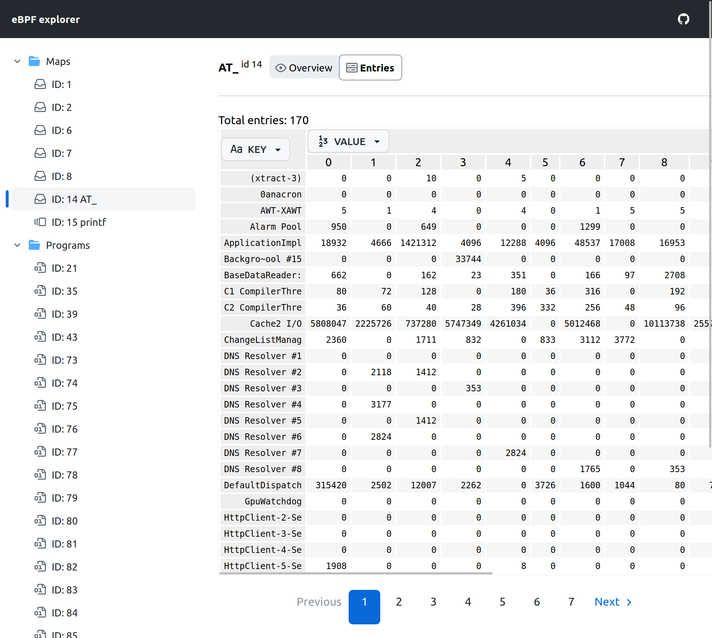

# eBPF explorer

eBPF is a web UI that lets you explore eBPF subsystem of your Linux host.

Explorer consists of two parts: an agent with GraphQL API, Prometheus scrape endpoint, and a web interface.
It is currently shipped as a single container. But you can also run them separately.

* [ebpfdev/dev-agent](https://github.com/ebpfdev/dev-agent), MIT license
* [ebpfdev/explorer-ui](https://github.com/ebpfdev/explorer-ui), MIT license

## Features

* view all maps and programs
* view graph of interconnected maps and programs
* view program's tracepoints/kprobe
* map entries table (Hash, HashPerCPU, Array, ArrayPerCPU)
  * view and edit in number/hex/string formats
* expose map entries as metrics for prometheus (also other useful metrics)


## Usage

Run explorer as a container:

```shell
docker run -ti --rm -p 8070:80 \
  --cap-add CAP_SYS_ADMIN --pid=host \
  -e BPF_DIR=/sys/fs/bpf -v /sys/fs/bpf:/sys/fs/bpf \
  ghcr.io/ebpfdev/explorer:v0.0.7
```

Privileges breakdown:

* `--cap-add CAP_SYS_ADMIN` (**required**)

  is needed for access BPF maps and programs (CAP_BPF is not yet enough)

* `--pid=host` (_optional_)

  is needed to determine tracepoint/kprobe attachment

* `-e BPF_DIR=/sys/fs/bpf -v /sys/fs/bpf:/sys/fs/bpf` (_optional_)
  
  is needed to determine paths of pinned maps, it is better to keep BPF_DIR (and target mount path)
  the same as your original eBPF FS, which can be determined with the following command:
  ```shell
  $ mount | grep bpf
  bpf on /sys/fs/bpf type bpf
  ```


Use `--etm` option to expose map (with name `AT_`) entries values to Prometheus endpoint:
```shell
docker run -ti --rm -p 8070:80 \
  --cap-add CAP_SYS_ADMIN --pid=host \
  -e BPF_DIR=/sys/fs/bpf -v /sys/fs/bpf:/sys/fs/bpf \
  ghcr.io/ebpfdev/explorer:v0.0.7 --etm -:AT_:string
```

If you only need GraphQL / Prometheus without web interface, you can run [agent](https://github.com/ebpfdev/dev-agent) independently:
```shell
docker run -ti --rm -p 8080:8080 \
  --cap-add CAP_SYS_ADMIN --pid=host \
  -e BPF_DIR=/sys/fs/bpf -v /sys/fs/bpf:/sys/fs/bpf \
  ghcr.io/ebpfdev/dev-agent:v0.0.5 server
```

Links:
* [http://localhost:8070](http://localhost:8070) - web interface
* [http://localhost:8070/dev-agent](http://localhost:8070/dev-agent) - Agent's GraphQL web client
* [http://localhost:8070/dev-agent/metrics](http://localhost:8070/dev-agent/metrics) - Prometheus scrape endpoint

# Demo

Run the explorer as described above and open [http://localhost:8070](http://localhost:8070) in your browser.

You should see a file tree view with a list of eBPF programs and maps:



Let's use [bpftrace](https://github.com/iovisor/bpftrace) to track amount of data read by each process:
```shell
$ sudo bpftrace -e 'tracepoint:syscalls:sys_exit_read /args->ret/ { @[comm] = sum(args->ret); }'
Attaching 1 probe...
```

Once you run it, list will be automatically updated:


`...`


Let's examine the `sys_exit_read` program:


We can see that this new program is using a new map called `AT_`.
Which probably means that it contains state of `@` variable of the program generated by `bpftrace`.

There is also `printf` map of type PerfEventArray. It is probably used by `printf()` invocation within `bpftrace` programs
and created regardless of whatever you actually use it or not: out program doesnt use it therefore we also
don't see that is used by the program in UI.

We can proceed to the `AT_` map page:


On the `Entries` subpage we can examine current state of the map:


Values are formatted as numbers by default if value size <= 8 bytes. Otherwise, they are displayed as hex strings.

We can also switch `KEY` representation to `string`:



# Prometheus scrape endpoint

There is a scrape endpoint for Prometheus available at `/metrics` path:
```shell
% curl http://localhost:8070/metrics
# HELP devagent_ebpf_map_count Number of eBPF maps
# TYPE devagent_ebpf_map_count gauge
devagent_ebpf_map_count{type="Hash"} 5
devagent_ebpf_map_count{type="PerCPUHash"} 1
devagent_ebpf_map_count{type="PerfEventArray"} 1
# HELP devagent_ebpf_map_entry_count Number of entries in an eBPF map
# TYPE devagent_ebpf_map_entry_count gauge
devagent_ebpf_map_entry_count{id="14",name="AT_",type="PerCPUHash"} 351
# HELP devagent_ebpf_map_entry_value Value of an eBPF map entry
# TYPE devagent_ebpf_map_entry_value gauge
devagent_ebpf_map_entry_value{cpu="0",id="14",key="(xtract-3)",name="AT_",type="PerCPUHash"} 0
devagent_ebpf_map_entry_value{cpu="0",id="14",key="000resolvconf",name="AT_",type="PerCPUHash"} 0
# (...)
devagent_ebpf_map_entry_value{cpu="15",id="14",key="01-ifupdown",name="AT_",type="PerCPUHash"} 0
# (...)
# HELP devagent_ebpf_prog_count Number of eBPF programs
# TYPE devagent_ebpf_prog_count gauge
devagent_ebpf_prog_count{type="CGroupDevice"} 19
devagent_ebpf_prog_count{type="CGroupSKB"} 10
devagent_ebpf_prog_count{type="TracePoint"} 1
# HELP devagent_ebpf_prog_run_count Number of times an eBPF program has been run
# TYPE devagent_ebpf_prog_run_count gauge
devagent_ebpf_prog_run_count{id="112",name="",tag="03b4eaae2f14641a",type="CGroupDevice"} 0
devagent_ebpf_prog_run_count{id="113",name="",tag="03b4eaae2f14641a",type="CGroupDevice"} 0
devagent_ebpf_prog_run_count{id="114",name="",tag="03b4eaae2f14641a",type="CGroupDevice"} 54
devagent_ebpf_prog_run_count{id="118",name="sys_exit_read",tag="90964a143ba6aa2c",type="TracePoint"} 2.866732e+06
devagent_ebpf_prog_run_count{id="127",name="",tag="3918c82a5f4c0360",type="CGroupDevice"} 7
# (...)
# HELP devagent_ebpf_prog_run_time Total time spent running eBPF programs
# TYPE devagent_ebpf_prog_run_time gauge
devagent_ebpf_prog_run_time{id="112",name="",tag="03b4eaae2f14641a",type="CGroupDevice"} 0
devagent_ebpf_prog_run_time{id="113",name="",tag="03b4eaae2f14641a",type="CGroupDevice"} 0
devagent_ebpf_prog_run_time{id="114",name="",tag="03b4eaae2f14641a",type="CGroupDevice"} 6.857e-05
devagent_ebpf_prog_run_time{id="118",name="sys_exit_read",tag="90964a143ba6aa2c",type="TracePoint"} 1.405393686
devagent_ebpf_prog_run_time{id="127",name="",tag="3918c82a5f4c0360",type="CGroupDevice"} 2.314e-06
# (...)
```

By default, metrics `devagent_ebpf_map_entry_count` and `devagent_ebpf_map_entry_value` are disabled.
To enable them for some of the maps (Array or Hash types), use `--etm option`, for the demo above:
```shell
docker run -ti --rm -p 8070:80 \
  --cap-add CAP_SYS_ADMIN --pid=host \
  -e BPF_DIR=/sys/fs/bpf -v /sys/fs/bpf:/sys/fs/bpf \
  ghcr.io/ebpfdev/explorer:v0.0.7 --etm -:AT_:string
```

Run with `--help` to see details of this option:
```shell
% docker run -ti --rm ghcr.io/ebpfdev/explorer:v0.0.7 --help               

  (edited)

   --entries-to-metrics value, --etm value [ --entries-to-metrics value, --etm value ]  (experimental, api may change)
    Configure which map entries should be exposed as metrics, in the format: id_start-id_end:metric_name_regexp:key_format.
    Example: '-:.+:string' to export any map with non-empty name while treating key as string.
    or '10-:.*:hex' to export any map after ID 10 with key represented in HEX format
    Available key formats: string, number, hex
    If a map matches multiple entries, the first one is used.

  (edited)
```

Some interesting visualization you could build with this data:

Programs run statistics:


Amount of system calls per process:


## Features

- [x] list of eBPF programs + details page
- [x] list of eBPF maps + details page
- [x] showing bounded maps of a programs (and vice versa)
- [ ] showing map content
  - [x] Hash (+ per CPU)
  - [x] Array (+ per CPU)
  - [ ] others are planned
- [ ] program introspection
  - [ ] eBPF bytecode
  - [ ] JIT disassembly
- [ ] visualization of map's content

    Like plotting a chart of values of maps keys
- [ ] program execution profiling
    
    I plan to keep track of duration/number of executions of a programs provided by kernel
    to draw nice charts
- [ ] cluster support

    To traverse over a cluster of agents within a single interface

Feedback and suggestions are welcome in [GitHub Issues](https://github.com/ebpfdev/explorer/issues) or via [alex@hsslb.ch](mailto:alex@hsslb.ch)

