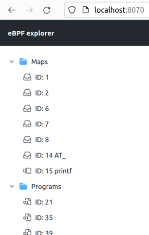
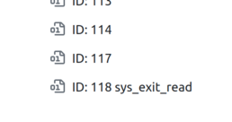

# eBPF explorer

eBPF is a web application that lets you explore eBPF subsystem of your Linux host.

Explorer consists of two parts: an agent with GraphQL API, Prometheus scrape endpoint, and a web interface.
It is currently shipped as a single container. But you can also run them separately.

* [ebpfdev/dev-agent](https://github.com/ebpfdev/dev-agent), MIT license
* [ebpfdev/explorer-ui](https://github.com/ebpfdev/explorer-ui), MIT license

## Usage

Docker image should be run with `--privileged` flag to allow it to access eBPF subsystem.

```shell
docker run -ti --rm --privileged -p 8070:80 ghcr.io/ebpfdev/explorer:v0.0.2
```

Use `--etm` option to expose map (with name `AT_SYSCALLNUM`) entries values to Prometheus endpoint:
```shell
docker run -ti --rm --privileged -p 8070:80 ghcr.io/ebpfdev/explorer:v0.0.2 --etm -:AT_SYSCALLNUM:string
```

If you only need GraphQL / Prometheus without web interface, you can run [agent](https://github.com/ebpfdev/dev-agent) independently:
```shell
docker run -ti --rm --privileged -p 8080:8080 ghcr.io/ebpfdev/dev-agent:v0.0.2 server
```

Links:
* [http://localhost:8070](http://localhost:8070) - web interface
* [http://localhost:8070/dev-agent](http://localhost:8070/dev-agent) - Agent's GraphQL web client
* [http://localhost:8070/dev-agent/metrics](http://localhost:8070/dev-agent/metrics) - Prometheus scrape endpoint

# Demo

Run the explorer as described above and open [http://localhost:8070](http://localhost:8070) in your browser.

You should see a file tree view with a list of eBPF programs and maps:


Let's use [bpftrace](https://github.com/iovisor/bpftrace) to track amount of data read by each process:
```shell
$ sudo bpftrace -e 'tracepoint:syscalls:sys_exit_read /args->ret/ { @[comm] = sum(args->ret); }'
Attaching 1 probe...
```

Once you run it, list will be automatically updated:



`...`



Let's examine the `sys_exit_read` program:


We can see that this new program is bounded to the new map `AT_`.
Which probably means that it contains state of `@` variable of a generated by `bpftrace` program.

There is also `printf` map of type PerfEventArray. It is probably used by `printf()` invocation within `bpftrace` programs
and created regardless of whatever you actually use it or not.

We can also examine current state of the `AT_` map, it is "Hash per CPU" type of map,
so we will see as many columns with values as amount of CPU cores we have:


It is probably better to switch representation of keys and values to string and number accordingly:


## Features

- [x] list of eBPF programs + details page
- [x] list of eBPF maps + details page
- [x] showing bounded maps of a programs (and vice versa)
- [ ] showing map content
  - [x] Hash (+ per CPU)
  - [x] Array (+ per CPU)
  - [ ] others are planned
- [ ] program introspection
  - [ ] eBPF bytecode
  - [ ] JIT disassembly
- [ ] visualization of map's content

    Like plotting a chart of values of maps keys
- [ ] program execution profiling
    
    I plan to keep track of duration/number of executions of a programs provided by kernel
    to draw nice charts
- [ ] cluster support

    To traverse over a cluster of agents within a single interface

Feedback and suggestions are welcome in [GitHub Issues](https://github.com/ebpfdev/explorer/issues) or via [alex@hsslb.ch](mailto:alex@hsslb.ch)

